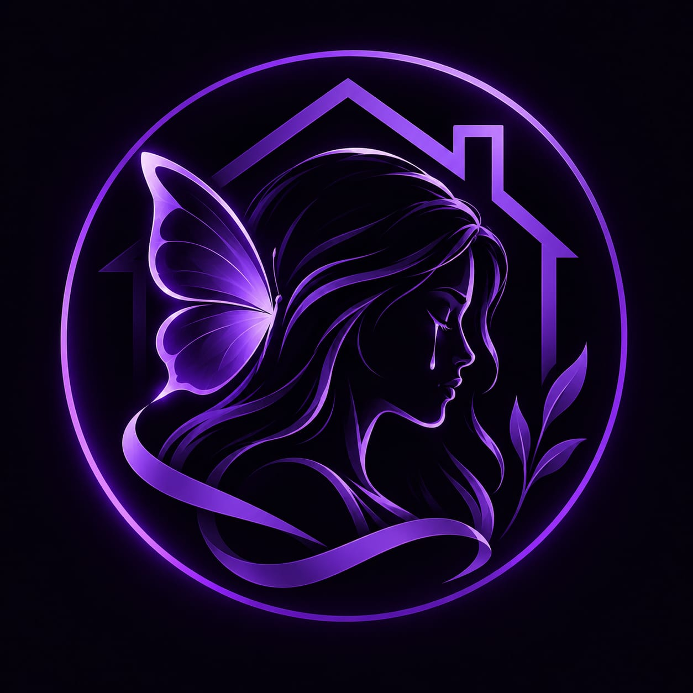

<p align="center">
  
</p>

<h1 align="center">Wonder Save</h1>
<p align="center"><strong>Informação • Apoio • Direitos</strong></p>
<p align="center">
  Site de conscientização sobre a violência doméstica contra a mulher,<br>
  seus impactos na sociedade e os caminhos de proteção e apoio.
</p>

---

## 📋 Índice

- [Sobre o Projeto](#-sobre-o-projeto)
- [Funcionalidades](#-funcionalidades)
- [Tecnologias Utilizadas](#-tecnologias-utilizadas)
- [Estrutura de Arquivos](#-estrutura-de-arquivos)
- [Pré-requisitos](#-pré-requisitos)
- [Como Executar](#-como-executar)
- [Deploy (GitHub Pages)](#-deploy-github-pages)
- [Referências e Legislação](#-referências-e-legislação)
- [Equipe](#-equipe)
- [Licença](#-licença)

---

## 💜 Sobre o Projeto

**Wonder Save** é um projeto web desenvolvido como Trabalho de Conclusão de Curso (TCC) da **ETEC de Presidente Venceslau — 3º DS (Desenvolvimento de Sistemas)**, com o objetivo de informar e conscientizar a sociedade sobre a violência doméstica contra a mulher.

O site aborda:

- **O que é** a violência doméstica e familiar
- **Tipos de violência** (física, psicológica, sexual, patrimonial, moral e virtual)
- **Sinais de alerta** para identificar uma situação de abuso
- **Direitos da mulher** garantidos pela legislação brasileira
- **Canais de apoio** como Disque 180, Delegacia da Mulher e serviços de assistência
- **Impacto na sociedade** — como a violência afeta famílias, economia e saúde mental
- **O que fazer** — passos práticos para quem está em situação de violência

> **Código do Projeto:** PRJ-2026-001 · **Versão:** v1.0

---

## ✨ Funcionalidades

| Funcionalidade | Descrição |
|---|---|
| **Landing page responsiva** | Layout adaptativo para desktop, tablet e mobile |
| **Navegação suave** | Scroll suave entre seções com destaque automático no menu |
| **Animações on-scroll** | Elementos animados conforme o usuário rola a página |
| **Parallax no hero** | Efeito de profundidade na imagem de fundo |
| **Cards interativos** | Efeito de glow no mouse e hover elevado |
| **Contador animado** | Estatísticas animam ao entrar na viewport |
| **Menu mobile** | Overlay de navegação em tela cheia para dispositivos móveis |
| **Design dark purple** | Tema escuro com paleta roxa, inspirado na cor símbolo do combate à violência contra a mulher |

---

## 🛠 Tecnologias Utilizadas

| Tecnologia | Uso |
|---|---|
| **HTML5** | Estrutura semântica das páginas |
| **CSS3** | Estilização com Custom Properties, Grid, Flexbox, animações e responsividade |
| **JavaScript (ES6+)** | Interatividade, Intersection Observer, scroll effects |
| **Google Fonts** | Tipografia — [Outfit](https://fonts.google.com/specimen/Outfit) (títulos) e [Inter](https://fonts.google.com/specimen/Inter) (corpo) |

### Dependências externas

> ⚠️ **Nenhuma dependência de instalação é necessária.** O projeto utiliza apenas HTML, CSS e JavaScript puros (vanilla). Não há `npm`, `node_modules` nem frameworks.

A única dependência externa é o **Google Fonts**, carregado via CDN diretamente no CSS:

```css
@import url('https://fonts.googleapis.com/css2?family=Inter:wght@300;400;500;600;700;800;900&family=Outfit:wght@300;400;500;600;700;800;900&display=swap');
```

---

## 📁 Estrutura de Arquivos

```
wonder-save/
├── assets/
│   └── img/
│       ├── hero-bg.jpg        # Imagem de fundo da seção hero
│       ├── flower.jpg         # Ilustração floral (seção Sobre e Ajuda)
│       └── logo.jpeg          # Logo do projeto
├── index.html                 # Página principal (HTML)
├── style.css                  # Folha de estilos (CSS)
├── script.js                  # Lógica e interatividade (JS)
├── logo.jpeg                  # Logo original do projeto
├── referencia.jpeg            # Imagem de referência visual
├── DEP.md                     # Documento de Especificação do Projeto
└── README.md                  # Este arquivo
```

---

## ✅ Pré-requisitos

Para rodar o projeto localmente você precisa apenas de:

1. **Um navegador web moderno** — Chrome, Firefox, Edge ou Safari (versões recentes)
2. **Um editor de código** _(opcional, para edição)_ — VS Code, Sublime Text, etc.

### Opcional (para servidor local)

Se quiser servir o projeto via HTTP local (evitando restrições de `file://`):

- [Live Server (extensão do VS Code)](https://marketplace.visualstudio.com/items?itemName=ritwickdey.LiveServer)
- Ou qualquer servidor HTTP simples:
  - **Python 3:** `python -m http.server 8080`
  - **Node.js:** `npx serve .`
  - **XAMPP / Laragon** (conforme previsto na arquitetura do DEP)

---

## 🚀 Como Executar

### Método 1 — Abrir diretamente (mais simples)

1. Clone ou baixe o repositório:
   ```bash
   git clone https://github.com/lenarasofia/wonder-save.git
   ```
2. Abra o arquivo `index.html` no navegador.

### Método 2 — Live Server (VS Code)

1. Abra a pasta do projeto no **VS Code**
2. Instale a extensão **Live Server** (se ainda não tiver)
3. Clique com o botão direito em `index.html` → **Open with Live Server**
4. O site abrirá automaticamente em `http://127.0.0.1:5500`

### Método 3 — Servidor HTTP com Python

```bash
cd wonder-save
python -m http.server 8080
```
Acesse `http://localhost:8080` no navegador.

---

## 🌐 Deploy (GitHub Pages)

O projeto é estático e pode ser hospedado diretamente no **GitHub Pages**:

1. No repositório do GitHub, vá em **Settings → Pages**
2. Em **Source**, selecione a branch `main` e a pasta `/ (root)`
3. Clique em **Save**
4. O site estará disponível em: `https://lenarasofia.github.io/wonder-save/`

---

## 📚 Referências e Legislação

| Legislação | Descrição |
|---|---|
| **Lei Maria da Penha** (Lei nº 11.340/2006) | Cria mecanismos para coibir a violência doméstica e familiar contra a mulher |
| **Lei do Feminicídio** (Lei nº 13.104/2015) | Qualifica o homicídio contra a mulher por razões de gênero como crime hediondo |
| **Lei do Stalking** (Lei nº 14.132/2021) | Tipifica o crime de perseguição |

### Canais de Apoio

- **Disque 180** — Central de Atendimento à Mulher (24h, gratuito)
- **Disque 190** — Polícia Militar (emergência)
- **Delegacia da Mulher** — Atendimento especializado
- **CRAS / CREAS** — Centros de assistência social

---

## 👥 Equipe

| Função | Nome |
|---|---|
| **Tech Lead / Desenvolvimento** | Lenara e Emilly |
| **Gerente de Projetos** | Vinícius Lima |

**Instituição:** ETEC de Presidente Venceslau  
**Curso:** 3º Desenvolvimento de Sistemas  
**Disciplina:** Projeto Multidisciplinar (TCC)  
**Ano:** 2026

---

## 📄 Licença

Este projeto foi desenvolvido para fins educacionais. Todos os direitos reservados aos autores.

---

<p align="center">
  <strong>💜 Juntas somos mais fortes.</strong>
</p>
